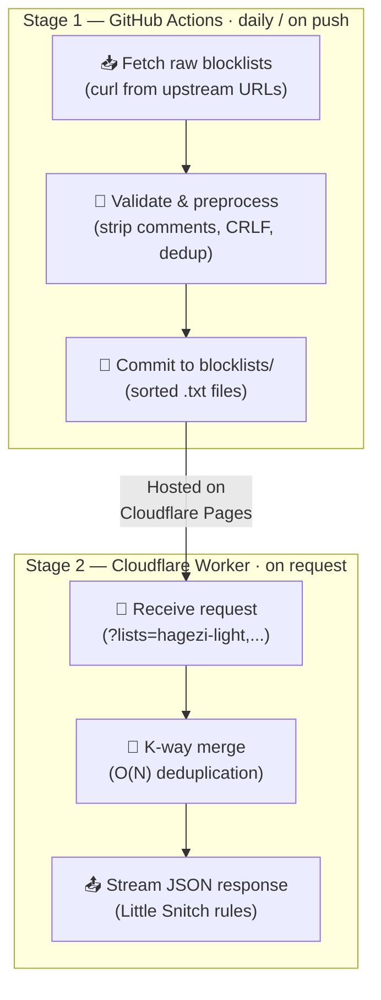

<!-- 📌 UPDATE THIS SINGLE URL WHEN READY -->

[ui-url]: https://peter-kotouc.com/little-snitch.html

# 🛡️ Little Snitch Blocklist Generator

> **🌐 Frontend UI:** [Open the configurator][ui-url]

A fully automated pipeline that fetches open-source DNS blocklists, preprocesses them, and serves custom-merged rulesets for [Little Snitch](https://obdev.at/products/littlesnitch/index.html) via a Cloudflare Worker API.

---

### 🔧 How It Works

This project has two stages:

1. **GitHub Actions Pipeline** — Runs daily (or on push). Downloads raw domain lists from upstream sources, validates their format, strips comments, deduplicates and sorts entries alphabetically, and commits the clean files to `blocklists/`.

2. **Cloudflare Worker API** — At request time, fetches the pre-sorted blocklist files, performs an O(N) k-way merge with deduplication across lists, and streams a Little Snitch-compatible JSON ruleset back to the client.

<p align="center">
  <picture>
    <source media="(prefers-color-scheme: dark)" srcset="https://mermaid.ink/img/Zmxvd2NoYXJ0IFRECiAgICBzdWJncmFwaCBzdGFnZTFbIlN0YWdlIDEg4oCUIEdpdEh1YiBBY3Rpb25zIMK3IGRhaWx5IC8gb24gcHVzaCJdCiAgICAgICAgQVsi8J-TpSBGZXRjaCByYXcgYmxvY2tsaXN0czxici8-KGN1cmwgZnJvbSB1cHN0cmVhbSBVUkxzKSJdCiAgICAgICAgQlsi8J-nuSBWYWxpZGF0ZSAmIHByZXByb2Nlc3M8YnIvPihzdHJpcCBjb21tZW50cywgQ1JMRiwgZGVkdXApIl0KICAgICAgICBDWyLwn5OCIENvbW1pdCB0byBibG9ja2xpc3RzLzxici8-KHNvcnRlZCAudHh0IGZpbGVzKSJdCiAgICAgICAgQSAtLT4gQiAtLT4gQwogICAgZW5kCgogICAgc3ViZ3JhcGggc3RhZ2UyWyJTdGFnZSAyIOKAlCBDbG91ZGZsYXJlIFdvcmtlciDCtyBvbiByZXF1ZXN0Il0KICAgICAgICBEWyLwn5OhIFJlY2VpdmUgcmVxdWVzdDxici8-KD9saXN0cz1oYWdlemktbGlnaHQsLi4uKSJdCiAgICAgICAgRVsi8J-UgCBLLXdheSBtZXJnZTxici8-KE8oTikgZGVkdXBsaWNhdGlvbikiXQogICAgICAgIEZbIvCfk6QgU3RyZWFtIEpTT04gcmVzcG9uc2U8YnIvPihMaXR0bGUgU25pdGNoIHJ1bGVzKSJdCiAgICAgICAgRCAtLT4gRSAtLT4gRgogICAgZW5kCgogICAgQyAtLSAiSG9zdGVkIG9uPGJyLz5DbG91ZGZsYXJlIFBhZ2VzIiAtLT4gRA==?bgColor=!1e1e1e&theme=dark">
    <source media="(prefers-color-scheme: light)" srcset="https://mermaid.ink/img/Zmxvd2NoYXJ0IFRECiAgICBzdWJncmFwaCBzdGFnZTFbIlN0YWdlIDEg4oCUIEdpdEh1YiBBY3Rpb25zIMK3IGRhaWx5IC8gb24gcHVzaCJdCiAgICAgICAgQVsi8J-TpSBGZXRjaCByYXcgYmxvY2tsaXN0czxici8-KGN1cmwgZnJvbSB1cHN0cmVhbSBVUkxzKSJdCiAgICAgICAgQlsi8J-nuSBWYWxpZGF0ZSAmIHByZXByb2Nlc3M8YnIvPihzdHJpcCBjb21tZW50cywgQ1JMRiwgZGVkdXApIl0KICAgICAgICBDWyLwn5OCIENvbW1pdCB0byBibG9ja2xpc3RzLzxici8-KHNvcnRlZCAudHh0IGZpbGVzKSJdCiAgICAgICAgQSAtLT4gQiAtLT4gQwogICAgZW5kCgogICAgc3ViZ3JhcGggc3RhZ2UyWyJTdGFnZSAyIOKAlCBDbG91ZGZsYXJlIFdvcmtlciDCtyBvbiByZXF1ZXN0Il0KICAgICAgICBEWyLwn5OhIFJlY2VpdmUgcmVxdWVzdDxici8-KD9saXN0cz1oYWdlemktbGlnaHQsLi4uKSJdCiAgICAgICAgRVsi8J-UgCBLLXdheSBtZXJnZTxici8-KE8oTikgZGVkdXBsaWNhdGlvbikiXQogICAgICAgIEZbIvCfk6QgU3RyZWFtIEpTT04gcmVzcG9uc2U8YnIvPihMaXR0bGUgU25pdGNoIHJ1bGVzKSJdCiAgICAgICAgRCAtLT4gRSAtLT4gRgogICAgZW5kCgogICAgQyAtLSAiSG9zdGVkIG9uPGJyLz5DbG91ZGZsYXJlIFBhZ2VzIiAtLT4gRA==?bgColor=!white&theme=neutral">
    
  </picture>
</p>

<details>
<summary>Mermaid Source for future edits</summary>



</details>

---

### 📋 Included Blocklists

These are sorted alphabetically by their configuration name.

| Name/File                                                  | Scope & Strategy    | License                                                                       | Source                                                                | Description                                                             |
| ---------------------------------------------------------- | ------------------- | ----------------------------------------------------------------------------- | --------------------------------------------------------------------- | ----------------------------------------------------------------------- |
| 🛡️ **`blocklistproject-ads_preprocessed_sorted.txt`**      | Ads                 | [Unlicense](https://github.com/blocklistproject/Lists/blob/master/LICENSE)    | [`blocklistproject/Lists`](https://github.com/blocklistproject/Lists) | Blocks domains serving ads.                                             |
| 🛡️ **`blocklistproject-malware_preprocessed_sorted.txt`**  | Malware             | [Unlicense](https://github.com/blocklistproject/Lists/blob/master/LICENSE)    | [`blocklistproject/Lists`](https://github.com/blocklistproject/Lists) | Blocks domains explicitly distributing malware and ransomware payloads. |
| 🛡️ **`blocklistproject-phishing_preprocessed_sorted.txt`** | Phishing            | [Unlicense](https://github.com/blocklistproject/Lists/blob/master/LICENSE)    | [`blocklistproject/Lists`](https://github.com/blocklistproject/Lists) | Blocks malicious domains impersonating legitimate sites for credential. |
| 🛡️ **`blocklistproject-tracking_preprocessed_sorted.txt`** | Tracking            | [Unlicense](https://github.com/blocklistproject/Lists/blob/master/LICENSE)    | [`blocklistproject/Lists`](https://github.com/blocklistproject/Lists) | Telemetry, analytics, and tracking domains from BlocklistProject.       |
| 🛡️ **`hagezi-apple_preprocessed_sorted.txt`**              | macOS/iOS Telemetry | [GPL-3.0 license](https://github.com/hagezi/dns-blocklists/blob/main/LICENSE) | [`hagezi/dns-blocklists`](https://github.com/hagezi/dns-blocklists)   | Blocks native Apple telemetry and background device tracking.           |
| 🛡️ **`hagezi-light_preprocessed_sorted.txt`**              | Ads & Tracking      | [GPL-3.0 license](https://github.com/hagezi/dns-blocklists/blob/main/LICENSE) | [`hagezi/dns-blocklists`](https://github.com/hagezi/dns-blocklists)   | Light version for high performance and zero false positives.            |
| 🛡️ **`hagezi-pro_preprocessed_sorted.txt`**                | Broader Coverage    | [GPL-3.0 license](https://github.com/hagezi/dns-blocklists/blob/main/LICENSE) | [`hagezi/dns-blocklists`](https://github.com/hagezi/dns-blocklists)   | Professional coverage. Includes ads, metrics, tracking, malware, etc.   |

> ⚠️ Always check the original source repositories for their specific licensing regarding the distribution or commercial use of the raw blocklists.

Only blocklists in plain `domain.com` format are supported. Upstream comments are stripped and replaced with standardized metadata headers (blocklist name, source URL, license, processing timestamp). The Cloudflare Worker skips these headers during the merge.

> [!TIP]
> **False Positives & Domain Removals:** This project only aggregates and merges blocklists from the upstream sources listed above. If you believe a domain is incorrectly blocked or wish to request its removal, please contact the maintainers of the respective **upstream blocklist** directly.

---

### 🚀 Usage

#### Using the hosted instance

You don't need to deploy this yourself! Use the **[Frontend UI][ui-url]** to select your blocklists visually, or pass a comma-separated list of blocklist names directly to the API:

```
https://blocklist-api.peter-kotouc.com/api/blocklists?lists=hagezi-light,blocklistproject-ads
```

The response is a streaming JSON document compatible with Little Snitch Rule Group Subscriptions:

```json
{
  "description": "Merged blocklist containing: hagezi-light, blocklistproject-ads",
  "name": "Dynamic Blocklist provided by Peter",
  "upstream_blocklists": [
    {
      "name": "Hagezi Light DNS Blocklist",
      "license": "GPL-3.0 license",
      "license_url": "..."
    }
  ],
  "rules": [
    { "action": "deny", "process": "any", "remote-domains": "ads.example.com" }
  ]
}
```

**Not sure which blocklists to use?** Check [`recommendations.json`](recommendations.json) for curated presets:

| Preset          | Description                                 | Example                            |
| --------------- | ------------------------------------------- | ---------------------------------- |
| **Light**       | Basic protection, near-zero false positives | `?lists=hagezi-light,hagezi-apple` |
| **Recommended** | Trackers, telemetry, malware, phishing      | `?lists=hagezi-pro,...`            |
| **Extreme**     | Maximum security (may block essential URLs) | All lists combined                 |

#### Deploying your own instance

If you'd like complete control over the blocklists and want to run your own endpoint, you can fork this repository and deploy it to Cloudflare Pages:

1. **Fork** this repository to your own GitHub account.
2. **Enable GitHub Actions Read and Write Permissions**:
   - Go to your forked repository's **Settings** -> **Actions** -> **General**.
   - Under **Workflow permissions**, select **Read and write permissions** and click **Save**. This allows the automated workflow to commit the updated blocklists back to your repository.
3. **Update the Configuration Variables**:
   - Open `scripts/fetch-blocklists.sh` and change `GITHUB_USERNAME` to your own GitHub handle. This ensures the automated bot tags _you_ when a blocklist download fails.
   - Open `functions/api/blocklists.js` and update `AUTHOR_NAME` and `REPOSITORY_URL` at the top of the file so your generated blocklists contain the correct metadata credits.
4. Go to the Cloudflare Dashboard -> **Workers & Pages**.
5. Click **Create** -> **Pages** -> **Connect to Git**.
6. Select your **forked** repository.
7. Enter `npm run build:cloudflare` as the "Build command" (this ensures Cloudflare runs the test suite and blocks the deployment if the code is broken, then strips non-essential files).
8. Leave the "Build output directory" empty (Cloudflare will automatically serve the root folder and the `functions/` API).
9. Click **Save and Deploy**.

---

### 📁 Project Structure

```
├── blocklist_sources.json        # Blocklist registry (names, URLs, licenses)
├── recommendations.json          # Curated presets (Light, Recommended, Extreme)
├── blocklists/                   # Pre-sorted .txt files (auto-generated, do not edit)
├── scripts/
│   └── fetch-blocklists.sh       # Download, validate, preprocess pipeline
├── functions/
│   └── api/
│       └── blocklists.js         # Cloudflare Worker — k-way merge API
├── tests/
│   ├── fetch.test.js             # Bash script integration tests
│   └── worker.test.js            # Cloudflare Worker integration tests
├── .github/
│   └── workflows/
│       └── fetch-blocklists.yml  # CI/CD pipeline definition
├── _headers                      # Cloudflare Pages global HTTP headers
├── robots.txt                    # Search engine & AI bot crawl directives
├── CONTRIBUTING.md               # Contribution guidelines
└── README.md
```

---

### ⚙️ How to Add More Blocklists

If you want to contribute and add a new blocklist to this repository, please review our [Contribution Guidelines](CONTRIBUTING.md) for detailed instructions on rules, formatting, and opening a Pull Request.

---

### 📜 Licensing

The **source code** in this repository (scripts, Cloudflare Worker, tests, configuration files) is released under the **MIT License**. See the [LICENSE](LICENSE) file for the full text.

The **upstream blocklist data** (the domain lists fetched from third-party sources) is **not** covered by the MIT license. Each blocklist retains its original upstream license:

| Blocklist Source | License                                                                    |
| ---------------- | -------------------------------------------------------------------------- |
| BlocklistProject | [Unlicense](https://github.com/blocklistproject/Lists/blob/master/LICENSE) |
| Hagezi           | [GPL-3.0](https://github.com/hagezi/dns-blocklists/blob/main/LICENSE)      |

This tool only fetches, preprocesses, and redistributes the upstream data with full attribution. The Cloudflare Worker API response includes an `upstream_blocklists` field listing the exact license and source for every included list.
